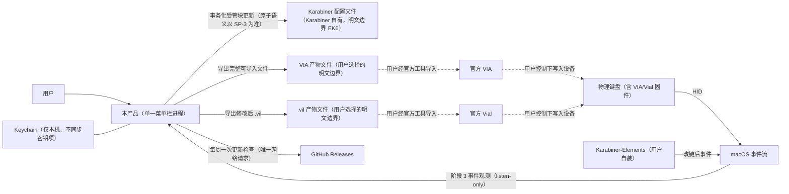
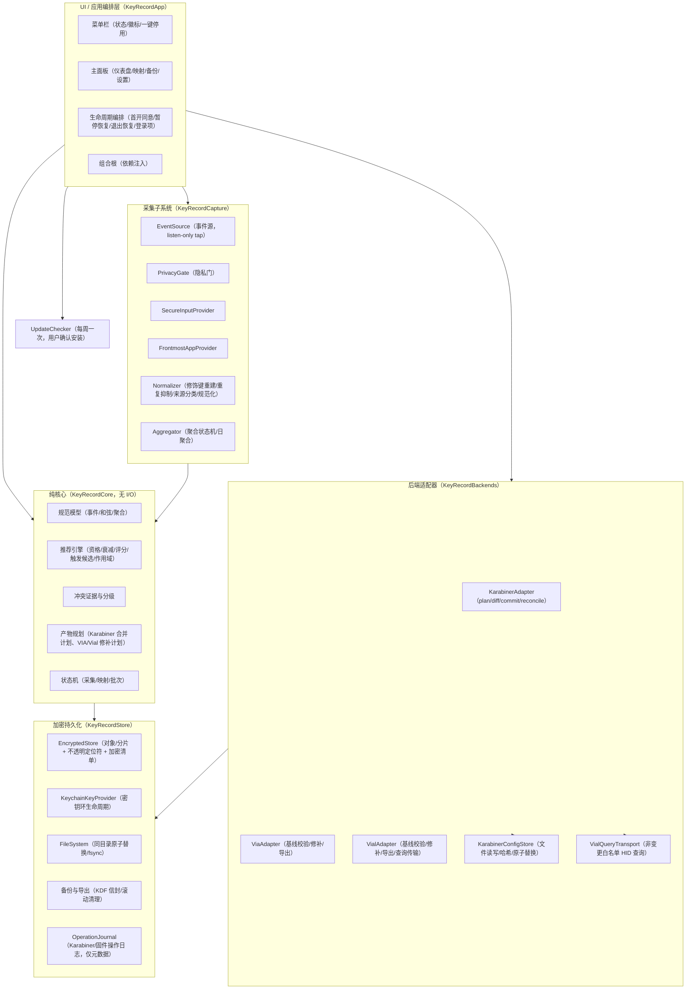

# 技术架构规格说明书

**产品：待定（内部代号：KeyRecord）**

| 项目 | 内容 |
|---|---|
| 文档版本 | v0.1（草案） |
| 日期 | 2026-09-03 |
| 状态 | 待评审 |
| 对应需求文档 | PRD v0.2（2026-09-03，修订草案），本文不修改其任何需求、数字、术语与非目标 |
| 目标读者 | 工程、QA、安全 QA；产品与设计师可参考第 1、2、14、15 章 |
| 承接关系 | 承接 PRD 未决事项 O5（最终 API 与 spike 验证细节）；O1/O2/O3/O4/O6/O7 在本文中仅映射到决策或门禁，不擅自落定 |

## 0. 阅读指引、图例与假设

### 0.1 图例

| 标记 | 含义 |
|---|---|
| 【已定】 | PRD v0.2 已确认的产品事实，本文仅作架构落实，不可违背 |
| 【架构决策】 | 本文在 PRD 约束内作出的技术决策，记录于第 16 章 ADR，可经评审推翻 |
| 【Spike 门禁】 | 未经 spike 验证不得冻结的能力或 API 细节，见第 13 章 spike 表 |
| 【待定 Ox】 | PRD 第 16 章登记的未决事项，本文不填补，仅给出承接方式 |

文中所有常量与 PRD 对齐：14 个活跃日半衰期、原始计数不少于 20 次、不少于 2 个不同本机自然日、70% 作用域阈值、Top 5、每项不超过 3 个触发候选、Karabiner 滚动 10 份备份、macOS 14+、打字平均 CPU 低于 1%、空闲平均 CPU 低于 0.1%（单逻辑核）、内存低于 100 MB、每周一次更新检查。

### 0.2 假设

1. 单用户单机使用；无账号体系（非目标 N1）。
2. Karabiner-Elements 由用户自行安装与授权；本产品不捆绑、不代装（K2）。
3. 用户可经官方工具使用 VIA/Vial；本产品只生成导入产物，不替代官方工具。
4. macOS 14 及以上为唯一支持系统；Universal 二进制（FR-S1）。
5. 正式产品名待定（O1）；代码内命名空间使用 `KeyRecord`，不作为对外名称。
6. 本文中出现的具体系统 API 名称用于说明意图；其可用性、行为与精度以第 13 章 spike 结论为准，spike 未通过前不得写入实现。

---

## 1. 架构原则

| 编号 | 原则 | 依据 |
|---|---|---|
| AP1 | 单一原生进程：Swift + SwiftUI/AppKit，菜单栏优先，无守护进程，无 CLI | PRD 13.1、FR-S3、N7 |
| AP2 | 行为数据严格本地：除每周一次更新检查外零网络外发；无遥测、无崩溃自动上报 | P1、6.4、FR-P1、FR-S5、N2 |
| AP3 | 隐私门先于一切处理：任何事件在进入规范化与聚合之前必须通过隐私门；不确定即失败关闭 | C8、P6、FR-P4 |
| AP4 | 阶段 3 观测口径：采集的是"经受支持改键路径变换后的 macOS 事件流观测"，永不声称应用已收到或已响应（阶段 4 不观测、不推断） | PRD 3.1、X2 |
| AP5 | 核心纯化与确定性：规范化、聚合、评分、冲突判定、产物规划为纯函数；相同输入必得相同输出（R1）；时钟、文件、设备访问全部经端口注入 | R1、FR-R1 |
| AP6 | 存储默认加密：应用管理的数据一律经认证加密；无明文回退；密钥缺失失败关闭 | P4、EK1-EK3 |
| AP7 | 后端隔离与事务化：每个后端一个适配器，配置/产物写入走显式事务；固件后端只导出、不写设备 | K3、V4、VL3、N9 |
| AP8 | 证据分级表达：推荐证据与物理负担估算分离；冲突证据分级；导出不等同部署 | R9、X2、10.1 |
| AP9 | 克制通知与权限最小化：菜单栏徽标为唯一主动提示；辅助功能权限仅用于菜单快捷键读取 | FR-U2、6.5 |
| AP10 | 非目标由结构保证：不存在的功能用"不存在的模块/代码路径"保证，而不是靠约定 | 第 14.2 节 |

---

## 2. 系统上下文与组件视图

### 2.1 系统上下文图



边界说明：

- 事件从 macOS 到本产品为单向只读观测，不拦截、不修改、不转发（ADR-003）。
- 阶段 4（应用/系统实际效果）不在图内，本产品不观测、不推断（X2）。
- 网络边界只有一个：每周一次的更新检查，安装前必须用户确认（6.4、FR-S4）。

### 2.2 组件图



依赖规则：

- `KeyRecordCore` 不依赖任何 I/O、UI、Apple 专有框架（仅 Foundation），是确定性测试的全部范围。
- UI 与基础设施只依赖 `KeyRecordCore` 定义的模型与端口协议；实现可替换。
- 采集与后端之间无直接依赖，只经核心模型通信。

---

## 3. Swift 模块分解与依赖方向

### 3.1 模块划分（Swift Package 目标）

| 模块 | 职责 | 依赖 | 允许引入的框架 |
|---|---|---|---|
| KeyRecordCore | 规范模型、聚合状态机、评分、冲突、产物规划、状态机、端口协议 | 无（仅 Foundation） | Foundation |
| KeyRecordCapture | EventSource 实现、tap 生命周期、PrivacyGate、各 Provider 实现 | KeyRecordCore | CoreGraphics、AppKit |
| KeyRecordStore | 加密对象存储、Keychain、原子文件、备份/KDF 信封、崩溃日志 | KeyRecordCore | CryptoKit、Security、Foundation |
| KeyRecordBackends | 三个后端适配器、Karabiner 配置存储、VIA/Vial 解析与修补、Vial 查询传输 | KeyRecordCore、KeyRecordStore | Foundation、IOKit（HID，仅 Vial 查询） |
| KeyRecordApp | 菜单栏与主面板 UI、生命周期编排、组合根、UpdateChecker | 以上全部 | SwiftUI、AppKit、ServiceManagement |
| KeyRecordTestSupport | 假实现（Fake）、夹具、黄金样本、属性测试生成器 | KeyRecordCore 等 | XCTest |

### 3.2 端口协议（测试接缝，全部为 protocol）

| 端口 | 定义位置 | 生产实现 | 测试实现 | 覆盖的不可控因素 |
|---|---|---|---|---|
| EventSource | KeyRecordCapture | CGEventTap（listen-only） | 脚本化事件回放 | 事件流、tap 重置、重复标记 |
| FrontmostAppProvider | KeyRecordCapture | NSWorkspace 前台应用 | 三态可控序列 | 已知归属 / 可靠无归属 / 不可判定、切换时序 |
| SecureInputProvider | KeyRecordCapture | 系统安全输入查询 | 可控序列 | Secure Input 开关、状态不可确定 |
| Clock / ActiveDayIndex | KeyRecordCore | 系统时钟 + 本地时区 | 固定时钟 | 自然日边界、跨时区、夏令时 |
| EncryptedStore | KeyRecordStore | 第 5 章对象存储 | 内存实现 + 故障注入 | 密钥缺失、密文损坏、I/O 失败 |
| FileSystem | KeyRecordStore | POSIX/Cocoa 原子写 | 故障注入文件系统 | 写中断、rename 失败、目录 fsync |
| KarabinerConfigStore | KeyRecordBackends | 配置文件读写与哈希 | 黄金文件 + 故障注入 | 外部编辑、版本未知、顺序保持 |
| VialQueryTransport | KeyRecordBackends | HID 报告传输 | 录制回放 | 查询响应、超时、设备缺席 |

评分、冲突判定、产物规划为纯函数：输入为模型值与注入时钟，输出为新值，不触碰任何端口。

### 3.3 标识生成

UUID 等随机标识仅用于对象主键（映射、批次、备份），由组合根注入生成器；不参与评分与产物内容，保证 R1 确定性。

---

## 4. 采集子系统：阶段 3 观测边界

### 4.1 观测声明（不可违背）

- 本产品观测的是阶段 3：经受支持的改键路径（Karabiner-Elements 与 macOS 软件层）变换后、出现在 macOS 事件流上的事件。【已定】
- 观测不证明应用已收到、已处理或已响应（阶段 4 未观测）。UI、推荐文案、冲突文案、文档与代码注释都不得出现"应用已生效/已触发"类表述。【已定，X2】
- 事件源为 listen-only：不拦截、不消费、不修改、不注入事件（ADR-003）。

### 4.2 ObservedKeyEvent 模型（内存瞬时对象，不持久化）

```swift
struct ObservedKeyEvent {
    let keyCode: UInt16
    let kind: Kind                 // keyDown / keyUp / flagsChanged
    let isAutoRepeat: Bool         // 事件自带 repeat 标记
    let modifierSnapshot: ModifierSnapshot // 由事件流重建，见 4.5
    let sourceClass: SourceClass   // ordinaryObserved / productTest / suspectedSynthetic
    let tapGeneration: UInt64      // tap 代数，重置后递增
}
```

规范约定：

- 事件对象只存在于内存；持久化的只有第 5 章的日聚合结果。事件对象不含时间戳字段；自然日归属在计数时刻由 `Clock` 求值。
- `sourceClass = ordinaryObserved` 仅表示"未命中任何怀疑信号的普通观测"，不构成对事件真实性的证明；本产品从不把任何事件标记为经证明的真实用户事件。
- `sourceClass = productTest` 的事件在隐私门之后、聚合之前无条件丢弃（C2 保证排除）。
- `sourceClass = suspectedSynthetic` 的事件不剔除，按 C2 降低置信度计入，并在 UI 标注；来源分类随日聚合的来源计数持久化（5.1），重启后 UI 标注与评分置信度可确定性重建，不保存任何序列或时间戳；识别能力边界属 O7【待定 O7】，首版只承诺识别"带产品标记的自身测试事件"与若干保守信号（如无进程来源的事件），不把任何启发式当作证明。

### 4.3 事件 Tap 位置与已知边界情况【Spike 门禁 SP-1】

Tap 的具体挂载点（HID 级 / Session 级 / Annotated Session 级）不由本文冻结，由 SP-1 决定。选择标准是：在用户已启用 Karabiner-Elements 的典型环境中，观测到的是变换后的事件，且每个物理按下只观测到一次。

下表列出各边界情况的处理策略；凡标注 SP 的条目，其系统行为以 spike 结论为准：

| 边界情况 | 处理策略 | 状态 |
|---|---|---|
| 既有 Karabiner 变换 | 观测点必须位于变换之后；tap 位置由 SP-1 在装有 Karabiner 的环境验证 | 【Spike 门禁】 |
| 重复计数风险 | 同一物理按下经多条路径（如原始设备 + 虚拟设备）各出现一次时会造成重复计数；SP-1 必须在 Karabiner 开关两种状态下验证单 tap 位置不产生重复；若任何候选位置存在重复，则冻结该位置并重新选型 | 【Spike 门禁】 |
| 系统消费（如截图、调度中心快捷键被系统截获） | 观测到与否取决于 tap 位置与系统行为；观测到即按 C5 归类为系统快捷键并默认全局作用域；观测不到则不产生任何记录，且不得声称该快捷键"未使用" | 【Spike 门禁 SP-1】+【已定 C5】 |
| 前台应用快照 | 在终止键按下时刻取前台应用 bundle ID（C7）。实现：监听应用激活通知并缓存前台状态，按下时刻读缓存，按三态处理（见 4.4）：可靠观测到前台应用则记其 bundle ID；可靠观测到前台上下文但无可用 bundle ID（如确实无前台应用）则计入 UNKNOWN 桶；缓存不可用、读取失败或状态自相矛盾等不可靠情形为 `indeterminate`，隐私门关闭、事件丢弃（失败关闭） | 【已定 C7/C8】+ 能力边界【Spike 门禁 SP-2】 |
| Tap 重置（超时/被禁用） | 收到禁用通知后立即重建 tap、`tapGeneration` 递增，修饰键状态置信度置为未知，直至重新建立（C3）；重置窗口内的事件按 4.4 失败关闭处理 | 【已定 C3】+ 行为【Spike 门禁 SP-2】 |
| 睡眠/唤醒 | 订阅睡眠/唤醒通知；睡眠前将聚合状态机归零（不放任悬空的 Held 状态跨睡眠），唤醒后修饰键置信度未知，直至重新建立 | 【已定 C3】 |
| 自动重复 | `isAutoRepeat = true` 的 keyDown 不计数（C1）；`flagsChanged` 的重复不产生计数 | 【已定 C1】 |
| 修饰键重建 | 见 4.5 | 【已定 C3】 |
| 产品标记测试事件 | 测试注入的事件携带产品自有标记（事件来源用户数据中的魔数），聚合前无条件丢弃；标记机制属内部实现，不进入任何文档化对外行为 | 【已定 C2】 |
| 疑似注入 | 不剔除，降置信度并 UI 标注（C2）；识别能力【待定 O7】 |
| Secure Input | 见 4.4 | 【已定 C8】 |
| 排除应用前台 | 见 4.4 | 【已定 P6】 |
| 一切不可确定状态 | 失败关闭：计数器零更新 | 【已定 C8/P6】 |

### 4.4 PrivacyGate（隐私门）

隐私门位于 EventSource 与 Normalizer 之间，是所有事件的必经路径。FrontmostAppProvider 的输出为三态：

```swift
enum FrontmostState {
    case known(bundleId: String)   // 可靠观测到前台应用
    case knownUnattributable       // 前台上下文被可靠观测，但无可用 bundle ID（计入 UNKNOWN 桶）
    case indeterminate             // 观测不可靠或不可判定（失败关闭）
}
```

每次事件处理前求值：

```
gateOpen = captureState == .collecting
        && secureInputState == .disabled          // 不可确定视为非 disabled
        && frontmostState != .indeterminate       // 前台状态不可判定即失败关闭
        && !(frontmostState == .known(b) && b ∈ exclusionList)

appBucket = frontmostState == .known(b) ? b : UNKNOWN   // knownUnattributable 计入 UNKNOWN 桶
```

- 任一条件不满足：事件被静默丢弃，所有计数器零更新，且不产生任何元计数（包括"排除期间发生过按键"这一类记录，P6）。【已定】
- Secure Input 期间、安全输入或前台状态不可判定期间，一律失败关闭（C8、P6、FR-C7、FR-P4）。
- UNKNOWN 桶只在"可靠观测到前台上下文、但无可用 bundle ID"（`knownUnattributable`）时产生计数（C7）；前台状态不可靠期间事件已被丢弃，不会进入 UNKNOWN 桶。UNKNOWN 桶因此可达，且不以削弱失败关闭为代价。
- 隐私门不产生日志内容，只允许产生无事件信息的结构化状态变迁记录（第 10.3 节）。

### 4.5 修饰键重建与规范化

- Normalizer 维护一个由 `flagsChanged` 事件驱动的修饰键状态机，每个修饰键族（cmd/opt/ctrl/shift）的状态为五态之一：`none / left / right / both / activeSideUnknown`（见 4.6）。
- 以下任一发生后，受影响修饰键族置为 `activeSideUnknown`：事件丢失迹象（如 flagsChanged 序列不自洽）、tap 重置、系统唤醒。状态在收到该族下一个确定性的修饰键事件后重新建立为 left/right/both（C3）。
- 计数落库规则【架构决策】：
  - 状态为 left/right/both：和弦按解析后的规范形式入库。
  - 状态为 `activeSideUnknown`：和弦以该状态原样入库（它本身就是规范形式的一种取值），UI 据此标注"侧别未知"。`activeSideUnknown` 与 left/right/both 是不同的和弦身份，不互相归并。
- UI 默认按族合并展示（left/right/both 归并为"按下"，`activeSideUnknown` 单独标注），可展开查看侧别明细（C3）。
- `fn` 不分左右，取 `none / active` 两态（若 SP-1 证明系统能提供侧别信息再扩展）。
- 自动重复抑制不依赖计时，只依赖事件自带的 repeat 标记与聚合状态机，避免时间窗启发式引入不确定性（C1）。

### 4.6 规范化和弦模型

```swift
enum ModifierSideState: Hashable {      // 每个修饰键族一态
    case none, left, right, both, activeSideUnknown
}

struct ModifierSet: Hashable {          // 按族记录，侧别未知可表示
    var cmd, opt, ctrl, shift: ModifierSideState
    var fn: FnState                     // none / active（不分左右）
}

struct Chord: Hashable {
    let key: KeyCode                     // 终止键，标准键盘键码（T3）
    let modifiers: ModifierSet
}
```

- 和弦身份包含各族的 `ModifierSideState`：`activeSideUnknown` 是可持久化、可比较、重启后可重建的规范取值，而非运行时标记。

- 首版只接受标准键盘键码与修饰键组合；未知或自定义键码不进入规范化输出（T3）。
- 裸键是 `modifiers` 全空的退化形式，单独走裸键计数通道（第 5 章），不带应用归属（P3/FR-P3）。

### 4.7 聚合状态机

对每个事件处理，Aggregator 维护一台按 `(tapGeneration, 活跃终止键)` 划分的状态机：

```
                flagsChanged
        ┌──────────────────────────┐
        v                          │
     [Idle] ──非重复 终止键 keyDown──> [Counted] ──对应 keyUp──> [Idle]
        │                            │
        │ 离散且可推荐：发出一次计数   │ 持续/有状态类（如 Cmd-Tab）：
        │                            │ 记录为 stateful 观测，可见但不进推荐
        v                            v
   隐私门关闭 / tap 重置 / 唤醒 / Secure Input / 状态不可确定
        => 全部归零到 [Idle]，修饰键置信度未知，期间零计数
```

计数语义：

- 首个非重复的终止键 keyDown 计一次；对应 keyUp 关闭该次状态。按住期间的重复 keyDown 不产生新状态、不计数（C1）。
- 不记录任何序列与精确时间戳；计数时刻由 `Clock` 求出本地自然日键（`dayKey`），该日首次有效计数时将其登记为一个活跃日（`ActiveDayIndex` 递增）。
- 离散快捷键与持续/有状态快捷键的区分【架构决策】：内置一张随规则版本发布的"已知持续/有状态系统和弦表"（如 Cmd-Tab），命中者记为 `stateful`，统计可见、不进入推荐、不可发起映射（C6、N14）。该表内容属规则版本的一部分，随评审更新；不构成对阶段 4 语义的证明。
- 系统快捷键（截图、调度中心等）单独归类 `scopeClass = system`，推荐时默认全局作用域（C5）。

---

## 5. 数据模型与加密持久化

### 5.1 存储模式（字段级）

所有对象经第 5.2 节的加密对象存储持久化。`dayKey` 为本地自然日键（如 `2026-09-03`，由本地时区求值）；不存在任何精确时间戳字段。`cycleId` 标识周期。

| 对象 | 字段 | 说明 |
|---|---|---|
| CycleRecord | cycleId, index（单调递增）, createdDay, closedDay?, isCurrent | 周期容器；无固定时长（L2） |
| CycleSummary | cycleId, perChordTotals: [(chord, appBucket, total)], perBareKeyTotals: [(keyCode, total)], distinctActiveDays | 重置时由明细单向汇总生成，保留汇总（L5）；不含日粒度 |
| DailyShortcutAggregate | cycleId, dayKey, chord, appBucket, kind（discrete/stateful）, scopeClass（normal/system）, sourceCounts{ordinaryCount, suspectedCount} | 明细统计；不变量：total = ordinaryCount + suspectedCount；允许含 bundle ID；禁止序列、精确时间戳、文本（6.2）；来源计数持久化使降置信度标注重启后可重建（C2） |
| DailyBareKeyAggregate | cycleId, dayKey, keyCode, sourceCounts{ordinaryCount, suspectedCount} | 裸键日计数器；total 不变量同上；禁止序列、精确时间戳、应用归属（FR-P3）；热力图数据源 |
| RecommendationSnapshot | snapshotId, cycleId, generatedDay, ruleVersion（第 6.6 节）, inputHash, entries[] | 内容与顺序确定的产物（确定性范围见第 6 章）；entries 含原始计数、跨日数、加权频率、评分、因子分解、作用域建议、至多 3 个触发候选、按键数估算及其口径（物理/逻辑）、证据链状态与置信度；inputHash 覆盖聚合输入与 physicalEvidenceByChord 各证据的规范引用及内容哈希，证据变化即使快照失效 |
| DesiredMapping | mappingId, name（默认"快捷键 + 应用"，M2）, sourceChord, trigger, outputChord, backend, scope（global / app(bundleId)）, backendConfig（profileIdentity / layer / device 限定）, state（第 8 章）, createdDay, ruleVersion | 用户意图；与批次、产物、声明、证据分离 |
| BackendDraft | draftId, backend, payload（按后端类型）, updatedDay | 各后端草稿独立保留（M1） |
| BatchOperation | batchId, backend, mappingIds[], baselineHash, backupId, phase/result, createdDay | 一次事务的记录；每批至多一份前镜像（K12、A4） |
| BackupMetadata | backupId, batchId, kind（karabinerBeforeImage / viaBaseline / viaArtifact / vilBaseline / vilArtifact）, provenanceHash, createdDay, autoCleanEligible | Karabiner 备份滚动 10 份（B1）；固件基线与产物仅显式删除（B2、FR-BK2） |
| VerificationEvidence | mappingId, batchId, artifactId, method（readback / vialCompare / userBehaviorTestConfirmation）, day, result, refHash | 验证来源与时间（A1、A2）；绑定批次与产物身份；固件"已验证"只能由本对象支撑 |
| ImportClaim | mappingId, batchId, artifactId, claimedDay | 用户声明已导入；绑定批次与产物身份；仅记录声明行为，不构成验证证据（A2） |
| OperationJournal | journalId, kind（karabiner / firmware）, batchId, phase, hashes, encryptedDestRef?, updatedDay | 崩溃协调日志；仅元数据，不含事件数据；目标引用仅存加密（9.1、9.5） |
| Preferences | expectedCollecting, currentCycleId, excludedBundleIds[], ignoredRecommendationKeys[], layoutPreset（ansi/iso/alice/split/none + 已询问标记）, loginItemEnabled, locale, keyboardPoolConfirmed[] | 期望采集状态（L3）、排除应用、布局预设（E2/E3）、登录项（L4）、忽略项（L5） |

字段约束：

- `appBucket` 为 bundle ID 字符串或 UNKNOWN 哨兵值。UNKNOWN 桶只在一种情形下产生：前台上下文被可靠观测、但不存在可用 bundle ID（4.4 的 `knownUnattributable`）。前台状态不可靠或不可判定（`indeterminate`）时，事件在隐私门处被丢弃（失败关闭），不产生任何计数，也不进入 UNKNOWN 桶。作用域分布的分母必须包含 UNKNOWN 桶（R11、术语表）。
- DailyShortcutAggregate 与 DailyBareKeyAggregate 为逻辑记录模型；物理存储按 `(cycleId, dayKey, aggregateType)` 分片，每分片一个信封文件、内含记录数组（见 5.2）。其余低基数对象仍为每对象一个信封文件。
- `DailyBareKeyAggregate` 在类型层面没有 `appBucket` 字段：不是"约定不写"，而是"结构上写不进去"。
- 固件原始文件、导入文件、宏等敏感内容作为不透明字节存入加密对象存储，不建索引、不可检索（V10、VL5、FR-BE7）。

### 5.2 加密对象存储设计（ADR-002）

数据规模论证：明细为 `(chord, appBucket, dayKey)` 粒度的日聚合记录与裸键日计数记录。重度使用下一年为数十万条记录量级、个位数 MB，按 `(cycleId, dayKey, aggregateType)` 分片后单分片体积小，整体重写代价可忽略。对象数量小、写入频率低、无关系查询需求。SQLite 默认不加密，引入 SQLCipher 会增加一个需要审计的原生依赖；因此选择自有的、可完整审计的加密对象存储。

设计：

1. **内存序列化**：对象在内存中经 Codable 序列化为字节；明文对象字节从不落盘（EK2）。
2. **版本化 AEAD 信封**：每个对象或分片独立加密为一个信封文件：
   ```
   Envelope {
       envelopeVersion: UInt16       // 信封格式版本
       keyId: UInt16                 // 密钥环版本标识（keyVersion）
       nonce: 12 bytes               // 每封随机
       ciphertext + tag              // 内含 objectType、schemaVersion、objectId/shardKey、payload
   }
   locator = HEX(HMAC-SHA256(locatorKey, objectType || objectIdOrShardKey))
   AAD     = envelopeVersion || keyId || locator
   ```
   逻辑对象类型、模式版本、对象 ID 与分片键只存在于密文内部；AAD 只认证不敏感的信封头与不透明定位符。定位键（locatorKey）与对象加密键经 HKDF 以不同 info 标签从当版主密钥派生（密钥分离），随密钥环一并版本化与删除；派生细节由 SP-6A 定稿。
3. **不透明定位符与加密清单**：存储目录为扁平结构，文件名即该对象/分片的不透明定位符（locator），不含日期、周期、对象类型、bundle ID 或键码等任何语义；临时文件同样使用无语义随机名。对象清单由一份加密清单（manifest，固定文件名、自身也是一个信封）维护：记录对象键、定位符、keyVersion 与删除标记；启动时解密清单建立索引，目录中存在而清单未登记者为孤儿文件，启动清理。日聚合明细按 `(cycleId, dayKey, aggregateType)` 组织为分片：一个分片一个信封文件，内含该日该类型的记录数组；单日单类型记录数受当日实际使用的不同组合数约束，分片整体重写代价小。其余低基数域对象（周期、映射、批次、快照、偏好、备份元数据等）与不透明字节块仍为每对象一个信封文件。无数据库单文件、无 WAL。残余泄露：文件数量、大小与更新时刻不隐藏，已在第 11 章威胁模型中明示。
4. **原子同目录替换**：写入流程为同目录临时文件 → fsync → rename → 目录 fsync。临时文件只含密文；启动时清理未完成的临时文件。具体 rename 语义（普通 rename 或交换式）以 SP-3/SP-6A 的平台验证结论为准【Spike 门禁】。
5. **无明文 WAL/临时区/事件日志**：不存在任何明文事件日志、明文临时区、明文回退模式（EK2）。
6. **崩溃恢复**：恢复粒度为单个分片或单个对象文件的"最后一次完整 rename 生效"；分片更新为读、解密、改、整体重写的单写者串行流程，半成品临时文件在启动时丢弃。写序为"先数据文件、后清单"，启动时对账清单与目录并清理孤儿文件。跨对象一致性（如 Karabiner 事务、固件导出）由 9.1 与 9.5 的操作日志协调，操作日志本身也是加密对象，只含批次元数据（哈希、阶段、备份 ID、加密目标引用），不含任何事件数据。
7. **删除语义**：对象与分片的删除均为文件移除 + 目录 fsync；完整删除（卸载准备）移除整个存储目录与 Keychain 密钥材料（EK4、P7）。

### 5.3 密钥生命周期（版本化密钥环）

- 本地密钥材料为一组版本化的 Keychain 对称密钥项（密钥环）：每个密钥版本是一个独立的 Keychain 项，可访问性全部限定为仅本机、不同步（`ThisDeviceOnly` 族），不随 iCloud Keychain 或任何云同步（EK1、P4）。【架构决策，具体可访问性级别以 SP-6A 验证为准】
- **密钥版本化**：信封头携带 `keyVersion`，指向密钥环上的对应版本。每个版本项为当版主密钥；对象加密键与定位键（locatorKey）经 HKDF 以不同 info 标签从当版主密钥派生（密钥分离，SP-6A 定稿）。轮换时生成新版本主密钥项；读取时按信封版本从环上选择派生来源，写入一律用当前版本。旧版本密钥项被显式保留，直至其保护的对象全部完成重加密或被删除；不存在"单一根密钥自动解开所有历史版本"的机制。轮换是否触发全量重加密由 SP-6A 的性能实测决定，首版允许惰性（读时重写）策略。
- **失败关闭**：当前或所需版本的密钥项缺失、损坏或 Keychain 不可用时，采集与读取全部停止，不生成任何本地明文副本（EK3、FR-P7）。UI 只提示"数据不可用"级别信息，不展示技术细节。
- **完整删除**：卸载准备流程删除密钥环上每一个保留版本的密钥项，此后密文不可恢复（EK4）。

### 5.4 完整备份的密码 KDF 信封（ADR-006）

完整备份（含全部数据）使用用户密码，经独立的、加盐的、版本化 KDF 派生密钥，再套第 5.2 节的 AEAD 信封；与本地存储密钥环相互独立（EK5、P5、FR-P6）。

选型声明：

- 选定 Argon2id。Apple 平台没有现成 API，必须引入第三方实现；因此该依赖必须通过安全评审与审计后才允许进入构建，最终依赖与参数在安全评审前不冻结。【Spike 门禁 SP-6B】
- 参数（内存、迭代、并行度、盐长）随信封版本记录，按实测目标调校：参考机型上派生耗时目标约 300 至 500 毫秒，具体数值由 SP-6B 实测确定并写入评审记录。
- 不预设回退方案：若 Argon2id 依赖或该设计未通过 SP-6B，完整备份功能及其发布门禁保持阻断，直至一份新的 KDF ADR 经安全评审通过；本文不预写替代算法，也不允许静默降级为更弱的 KDF。不得声称 Apple 提供 Argon2id；CryptoKit 不提供 Argon2id 或 PBKDF2，其他框架中的 KDF 能力也不构成未经评审的自动回退方案。
- 常规导出（映射与偏好）不经过此信封、不含统计数据，属于用户显式选择的明文边界，导出时 UI 明确提示（EK6、B3、FR-BK3）。

### 5.5 明文边界清单

产品加密边界之外有且仅有两类明文（EK6）：

1. 用户显式选择的导出文件（映射/偏好导出、固件产物、完整备份密码信封文件本身由用户放置）；这些目标的路径/书签引用在产品内只存于加密对象（9.5）。
2. Karabiner 自有的配置文件（本产品仅在第 9.1 节事务内写入）。

UI 在涉及这两类边界时明确提示。固件基线与产物文件：应用内保存的副本一律加密（B2）；用户经官方工具导出的原始文件归用户管理。

---

## 6. 推荐引擎

推荐引擎为 KeyRecordCore 内的纯函数集合，输入为某周期的聚合数据、偏好、规则版本与按和弦索引的物理证据（physicalEvidenceByChord），输出为 RecommendationSnapshot。确定性范围定义如下：相同规范化输入、相同 ruleVersion、相同注入时钟与自然日推进下，快照的规范内容（entries 的内容与顺序）与评分结果完全一致（R1、FR-R1）。以下各项不在确定性相等范围内：快照 ID 等对象主键、生成元数据、AEAD nonce 与密文；它们由注入的标识生成器与加密层产生，不参与 R1 的相等性判断。本章公式中的 `count(...)` 均指 5.1 来源计数之和（total = ordinaryCount + suspectedCount 的不变量）。

### 6.1 资格判定（【已定 R4】）

```
eligible(chord, cycle):
    rawCount  = Σ DailyShortcutAggregate.count  (按 chord 聚合，含所有 appBucket)
    dayCount  = |{ dayKey : 该 chord 当日 count > 0 }|   // 不同本机自然日数
    return kind(chord) == .discrete && rawCount >= 20 && dayCount >= 2
```

- 半衰期衰减不参与资格判定，只影响排序（R4、FR-R2）。
- 未达门槛者为"观察候选"，统计即时可见并标识样本不足（R5）。
- 任何已观察到的、且所选后端支持的离散快捷键，用户都可主动发起映射，不受门槛限制（R6）；`stateful` 观测除外（C6、N14）。

### 6.2 活跃日索引与衰减

- `ActiveDayIndex`：对周期内每个存在有效计数的本机自然日按先后赋予单调递增索引（0,1,2,...）；没有计数的自然日不占索引。
- 半衰期固定为 14 个活跃日【已定】：

```
weight(day) = 2 ^ (-(Amax - A(day)) / 14)
wFreq(chord) = Σ_day count(chord, day) × weight(day)        // 跨 appBucket 求和
wCount(chord, app) = Σ_day count(chord, day, app) × weight(day)
```

`Amax` 为当前最大活跃日索引。构造数据验证衰减曲线的测试见 FR-R3。

### 6.3 作用域默认（【已定 R10-R13】）

```
share(app) = wCount(chord, app) / Σ_allBuckets wCount(chord, bucket)   // 分母含 UNKNOWN 桶
candidates = { app | app ≠ UNKNOWN 且 wCount(chord, app) > 0 }          // 候选应用排除 UNKNOWN
topApp = argmax_{app ∈ candidates} share(app)                           // 平分按 bundle ID 规范序（字典序升序）取先
defaultScope = candidates 非空 且 share(topApp) >= 0.70 ? .app(topApp) : .global
```

- 分母必须包含未知归属桶（R11、FR-R6）；候选应用集合不包含 UNKNOWN，UNKNOWN 永不作为"Top 应用"被选中。
- 占比平分按 bundle ID 规范序（字典序升序）取先，结果确定。
- 统计中没有任何已知应用（candidates 为空）时：默认全局；应用作用域选项置为不可用并附说明，用户不能改到无效应用作用域；卡片仍保留"全局/高频应用"两选项的 UI 契约（R10）。
- 浏览器仅支持"整个浏览器"作用域，不做站点级区分（R12、N3）。
- 系统快捷键默认全局（R13、C5）。
- 默认值在存在至少一个有效已知应用候选时可被用户修改（R11）；Karabiner 卡片始终提供"高频应用"与"全局"两个选项（R10）。

### 6.4 评分公式与因子分解

物理估算的输入为类型化证据链，由后端适配器从已验证固件配置与当前改键路径装配：

```swift
struct TransformEvidence {          // 链条中一段变换的可用性证据
    let link: Link                  // stage1to2Firmware / stage2to3Karabiner / stage2to3MacOS
    let status: Status              // verified / absent / ambiguous / unsupported
                                   // multiDeviceUncertain / externallyChanged
    let reference: CanonicalRef     // 该段变换的规范映射引用（固件配置条目 / 规则标识 / 系统行为标识）
    let mapping: CanonicalTransform? // 纯解析器实际消费的规范变换；仅 verified 时必须存在
    let contentHash: ContentHash    // mapping 规范编码的哈希；内容变化即证据失效
}

struct GeometryEvidence {
    let source: GeometrySource      // viaVialLayout / userPreset
    let model: CanonicalGeometry    // 物理位置、坐标与评分所需属性的规范数据
    let contentHash: ContentHash    // model 规范编码的哈希
}

struct PhysicalEvidence {
    let geometry: GeometryEvidence? // 仅几何，不含阶段 2 映射；nil 表示无几何证据
    let chain: [TransformEvidence]  // 物理位置 → 固件 1→2 → 各段相关 2→3 变换
}

struct ResolvedPhysicalGesture {    // 解析输出：某阶段 3 和弦对应的唯一物理动作
    let positions: [PhysicalPosition]   // 物理键位动作序列（含次序）
}
```

规则版本 `scoring.v1`【架构决策，常量随版本评审调整】：

```
resolveGesture(chord, physicalEvidenceByChord[chord]) -> one ResolvedPhysicalGesture | none | multiple | ambiguous
// 仅当 geometry 存在、chain 非空且每段 status == verified、mapping 存在且哈希匹配时尝试解析；
// 结果必须恰好唯一：零个、多个或歧义结果均退回逻辑口径

effortPerUse(chord) =
    resolveGesture 得唯一手势 g: physicalCost(g, geometry)                 // 物理口径
    否则:                      logicalCost(chord)                          // 逻辑和弦键数口径
        // logicalCost = 1 + Σ_family pressedKeys(family)；left/right/activeSideUnknown 计 1，both 计 2，fn active 计 1

savedPerUse = max(effortPerUse(sourceChord) - effortPerUse(trigger), 0)
confidence  = sourceReliability × layoutCompleteness   // 各 ∈ (0,1]，查表确定，无随机
score       = wFreq × savedPerUse × confidence

sourceReliability(chord) = table( ordinaryCount / (ordinaryCount + suspectedCount) )
// 输入为 5.1 持久化的来源计数；table 为规则版本内的确定性查表，重启后可重建
```

- `resolveGesture` 是纯函数，直接消费 `GeometryEvidence.model` 与每段 `CanonicalTransform`，按链逆向解析阶段 3 和弦对应的阶段 1 动作；它不通过引用访问 I/O 或外部可变状态。`physicalCost` 只消费解析出的 `ResolvedPhysicalGesture` 与 `CanonicalGeometry`，绝不直接消费阶段 3 和弦；解析结果为零个、多个或歧义时一律退回逻辑口径。
- 物理口径只在证据链完整时给出：几何规范数据可用且哈希匹配、固件阶段 1→2 映射来自已验证固件配置、每段相关阶段 2→3 变换（含相关 Karabiner 与 macOS 变换）均为 verified，且携带规范变换数据、引用与匹配的内容哈希。任一环节缺失、哈希不匹配、歧义、不受支持、多设备不确定或已外部变更，即退化为逻辑和弦键数口径并标注置信度（R9、E2、FR-R5、FR-E1）。布局预设仅提供几何信息，不提供阶段 2 映射；阶段 2 信息仅来自已验证的固件配置（PRD 3.1）。E4 单主评分布局不变。
- 推荐输入显式包含自包含的 `physicalEvidenceByChord`；快照 `inputHash` 覆盖几何模型哈希及每条变换证据的规范引用、规范变换与内容哈希，任一证据内容变化都会改变 `inputHash` 并使旧快照失效（5.1、6.6）。
- 排序按 `score` 降序；平分按 `Chord` 规范序列升序，保证确定性。
- 每条推荐输出因子分解：加权频率、每次按键数、建议触发按键数、应用集中度、置信度（R3）。
- 首页展示 Top 5 推荐与全部候选列表（R7）；不展示、不承诺时间节省或健康收益（R9）。

### 6.5 触发候选生成

- 每项最多 3 个触发候选（R8、FR-R4）。
- 自动候选不含裸可打印键；用户手动选择裸可打印键时出现高风险二次确认（T1、FR-R7）。
- 自动候选来源仅限：用户确认过的特殊键池、更简的修饰键组合、固件侧安全可用位置（VIA/Vial 的 KC_NO）（T2）。
- 仅输出标准键盘键码与修饰键组合（T3、N13）。
- 候选生成是纯函数，输入含偏好中的键池确认记录与各后端能力约束（第 9 章）。

### 6.6 规则版本化

`ruleVersion` 为复合版本：资格规则、评分常量、触发候选生成规则、系统和弦表、冲突规则、键码方言各自独立编号。快照记录完整 `ruleVersion` 与 `inputHash`；任一子版本变化触发重算。版本内容变更必须经评审，保证可回溯与可解释（R1）。

---

## 7. 冲突证据与分级

### 7.1 证据分类（全部为上不完备的部分证据，无阶段 4 证明【已定 X2】）

| 证据类 | 来源 | 完备性声明 |
|---|---|---|
| observed | 阶段 3 观测到的快捷键统计 | 观测不证明应用收到；只说明事件流上出现过 |
| karabiner-overlap | Karabiner 配置中既有用户规则与受管块 | 仅覆盖配置文件可见的规则；对其他改键路径无证据 |
| known-system-risk | 已知系统快捷键语义表（随规则版本发布） | 系统行为随版本变化，表为保守近似 |
| menu-discovered | 经可选辅助功能权限读取的目标应用菜单快捷键 | 菜单读取是不完整发现机制；拒绝授权时该证据缺失 |

"未发现冲突不等于无冲突"（X2）；证据不足一律按提示级处理。

### 7.2 严重级别与处理（【已定 9.2】）

| 级别 | 触发条件 | 处理 |
|---|---|---|
| 硬阻断 | 结构损坏；映射环（含双向循环，K9）；受管触发与既有规则在 (trigger, scope, device, profile) 四元组上重叠；唯一层入口/复位/Bootloader 入口将丢失 | 禁止应用，应用按钮不可用（FR-M3） |
| 高风险 | 与已观察快捷键、系统快捷键、常见语义冲突 | 警告并二次确认（FR-M4） |
| 提示 | 信息不足的潜在不确定性；辅助功能权限缺失导致的证据缺失（X3） | 信息提示，可继续（FR-M5） |

### 7.3 重叠判定域

重叠判定覆盖四个维度：触发（trigger）、作用域（scope，全局/应用 bundle ID）、设备限定（默认全部键盘或限定设备，K7）、Profile（映射绑定单个 Profile，K5）。同一触发可在互不重叠的应用作用域中有不同映射；作用域重叠即冲突（K8）。环检测在期望映射图上做确定性遍历，发现环即硬阻断（K9）。

---

## 8. 映射域与状态机

### 8.1 域对象分离（【架构决策】）

以下六类对象在模型层分离，互不兼任，杜绝"导出即部署"式混淆：

1. **DesiredMapping**：用户意图（第 5.1 节）。
2. **BatchOperation**：一次应用/导出事务。
3. **导出产物（Artifact）**：产物字节及其元数据（BackupMetadata 记录，含来源哈希）。"ArtifactExported"是产物操作的结果记录，不是映射状态；它与映射进入"等待用户导入"原子发生（9.5）。
4. **ImportClaim**：用户声明"已用官方工具导入"，仅记录声明行为与时间；它永远不构成验证证据。
5. **VerificationEvidence**：某次验证的来源、时间与结果；固件映射记为"已验证"只能依赖它。
6. **OperationJournal**：Karabiner 与固件操作的崩溃协调日志（仅元数据，见 9.1 与 9.5）。

### 8.2 Karabiner 状态机（与 PRD 10.1 一致）

```
草稿 --应用--> 已写入 --读回校验通过--> 待验证 --持续配置验证通过--> 已验证
                  |                                              |
                  v                                              v
              外部变更                                          失败
已写入 / 待验证 / 已验证 / 失败 --用户回滚（先按 9.1 哈希分类，仅当前哈希等于本产品写入结果时自动写回前镜像）--> 已回退
任一持久状态检测到外部修改 --> 外部变更
```

- 读回校验：写入完成后重读文件并比对哈希（K3、A4）。
- 持续配置验证：周期性读回比对受管块哈希，发现不等即转"外部变更"（A2、K11）。
- 外部变更的三选一：采纳外部变更 / 重新应用受管规则 / 停止管理（K11、FR-BE3）。

### 8.3 固件状态机（与 PRD 10.1 一致）

```
草稿 --导出成功（原子：产物记录创建 + 状态迁移，见 9.5）--> 等待用户导入 --用户声明--> 用户声明已导入
                                                                       |
                                                                       |-- 验证通过 --> 已验证
                                                                       |-- 验证未通过 --> 失败
等待用户导入 --放弃产物（仅删除产物与记录）--> 草稿
用户声明已导入 / 已验证 / 失败 --导入原始基线的引导回滚（用户确认）--> 已回退
任一持久状态检测到外部修改 --> 外部变更
```

通用规则：

- "导出成功"是产物操作的结果，记录在产物对象与批次上，不是独立的持久映射状态；它与映射进入"等待用户导入"原子发生（9.5 操作日志保证，FR-A1）。
- 导入声明（ImportClaim）只记录用户声明行为，不构成验证证据；设备状态只有经对应后端验证方式确认后才记为"已验证"（A2）：Vial 为非变更白名单比对，VIA 为用户行为测试确认（`userBehaviorTestConfirmation`）。
- 回滚与放弃在每个相关状态都有安全出口：等待用户导入仅可放弃产物（删除产物与记录，回到草稿，不涉及设备）；用户声明已导入/已验证/失败提供导入原始基线的引导，用户确认后转为已回退（A7）。

### 8.4 回滚语义

| 后端 | 回滚机制 |
|---|---|
| Karabiner | 回滚前先重读并分类当前哈希：等于本产品写入结果 → 用该批次加密前镜像做同目录原子替换并读回校验；等于读取基线 → 受管写入未落盘，仅标记状态、不写文件；两者皆非 → 外部变更，禁止自动写（K12、K13、FR-BE1） |
| VIA | 导出后未声明导入（等待用户导入）：仅放弃并删除产物及其记录，映射回到草稿，不涉及设备；用户声明已导入/已验证/失败：引导用户经官方 VIA 导入该批次保留的原始基线，用户确认后转为已回退（A7） |
| Vial | 同 VIA：未导入仅放弃产物；已声明导入/已验证/失败经官方 Vial 导入保留的原始 .vil 基线完成回滚（A7） |
| 紧急停用 | 菜单栏一键停用本产品 Karabiner 规则，立即生效、可恢复（A6，实现见 9.1） |

---

## 9. 后端适配器

### 9.1 KarabinerAdapter：plan / diff / commit / reconcile（ADR-007）

**前置门禁**

- 支持版本门禁：Karabiner 版本在支持矩阵内才允许写入；未知版本只读与导出（K10）。支持矩阵【待定 O4】，由 SP-3 产出。
- 显式 Profile 身份：映射绑定到用户选择的、已经过写入测试的单个 Profile（以稳定标识记录）；统计则合并所有 Profile（K5）。

**受管块**

- 本产品规则组织为目标 Profile 内一个连续的受管块，使用独立命名空间标记（K4、ADR-007）。
- 用户既有规则的相对顺序与内容在应用前后完全一致（FR-BE2）；已知会与用户规则重叠的情形按冲突硬阻断，不静默调整用户规则（K4）。
- diff 为结构化 diff：仅在受管块区间替换内容，区间外字节保持不变。

**commit 事务（伪代码）**

```
commit(batch):
    cfg0   = readConfig(profilePath)
    hBase  = hash(cfg0)
    require hBase == batch.baselineHash else abort(.externalChange)     // 基线哈希乐观并发（K3）
    cfg1   = applyManagedBlock(cfg0, batch.rules)                        // 纯函数，结构化替换
    before = encryptStore.put(BeforeImage(cfg0))                         // 每批一份加密前镜像（K12）
    journal.write(phase: .backedUp, batchId, hBase, hExpect = hash(cfg1), before.id)  // 仅元数据
    tmp    = writeTempFileSameDir(cfg1) ; fsync(tmp)                     // 同目录临时文件
    rename(tmp, profilePath) ; fsyncDir()                                // 原子替换【平台细节 Spike 门禁 SP-3】
    hRead  = hash(readConfig(profilePath))                               // 写后读回校验（A4）
    if hRead == hExpect:
        journal.write(phase: .committed) ; enforceRollingBackups(10)     // 滚动 10 份（B1）
    else:
        match classify(hash(readConfig(profilePath))):                   // 复读并分类当前哈希
            case hExpect:                                                // 提交实际已落盘（初次读回异常）
                journal.write(phase: .committed) ; enforceRollingBackups(10)
            case hBase:                                                  // 提交未落盘：不写任何内容
                journal.write(phase: .failed) ; abort(.commitNotApplied)
            default:                                                     // 外部变更：禁止自动写
                journal.write(phase: .externalChange) ; abort(.externalChange)
```

**读回不一致的分类恢复（FR-BE1）**：读回校验不一致时绝不无条件恢复前镜像。先重读并分类当前哈希：等于 `hExpect`（本产品写入结果）时才允许自动动作；等于 `hBase`（读取基线）说明提交未落盘，只标记失败、不写文件；两者皆非一律按外部变更处理（K11），禁止任何自动写入。用户发起的回滚同样先经此分类，仅 `hExpect` 分支执行前镜像的原子替换。

**崩溃协调（reconcile，K13、FR-BE3）**

启动时检查未完成的 journal：

| 当前文件哈希 | 结论 | 动作 |
|---|---|---|
| 等于 `hExpect`（本产品写入结果） | 提交已落盘 | 自动完成收尾（清理 journal、状态推进）或按用户请求回滚到前镜像 |
| 等于 `hBase`（读取基线） | 提交未落盘 | 安全：不重写文件，批次标记失败，可重新应用 |
| 两者皆非 | 外部变更 | 禁止任何自动恢复或回滚，走 K11 三选一 |

**外部变更**：检测到受管块或文件哈希与预期不符时提示三选一：采纳外部变更 / 重新应用受管规则 / 停止管理（K11）。

**一键停用（A6）**：菜单栏切换为"停用"时，以同一事务路径把受管块内容置空（保留块标记与零条规则），原规则集存入加密存储；恢复时以事务写回。该实现只复用已验证的写路径，不依赖 Karabiner 的规则级禁用能力。可度量目标：在支持版本上，从菜单栏点击到受管规则失效不超过 2 秒（p95），由 SP-3 的重载时延测试验证；不达标则阻断 Karabiner 稳定发布（Phase 3 门禁）。

**行为测试清理（A3、FR-A2）**：应用作用域的行为测试使用临时的 KeyRecord 命名空间等效规则；测试结束立即以事务移除；下次启动时 reconcile 同时检查并清理任何残留临时规则。

### 9.2 ViaAdapter

- **目标格式**：厂商定义 JSON 的格式版本 V2/V3 为支持目标（V1、O4）。V2/V3 是定义文件格式版本，不是设备协议版本。兼容性按五个独立版本轴判定：定义 schema、设备协议、布局备份格式、键码方言、官方导入器兼容性（PRD 8.1）。任一必需版本轴未知或不受支持即阻断生成（V7、FR-BE5）。版本轴支持矩阵【待定 O4】，由 SP-4A/SP-4B 产出。
- **基线**：每个批次从用户最近一次经官方工具导出的基线出发；无最新基线即阻断（V3、FR-BE8）。基线与产物均记录来源哈希（A5）。
- **生成前校验**：设备身份、布局、层与基线一致，不一致即阻断（V9）。
- **解析器**：有界的、保留原始内容的瞬时解析器，只在内存中工作；未知子树与宏子树保持不透明、不被修改，导出后与基线字节级一致（V10、FR-BE7）。"有界"指输入大小与嵌套深度有硬上限，超限拒绝解析。
- **修补**：只修改用户选中的键位槽，其余内容原样保留（V9、FR-BE8）。产物是"经官方 VIA 可完整导入的文件"，其与基线的语义差异仅出现在选中槽位。
- **层约束**：仅使用现有可达层；不新建层、不改层入口（V5、N10）。自动候选仅允许一步 MO/LT；TG/TO 仅手动选择（V5、FR-BE4）。KC_TRNS 视为占用，KC_NO 可作为自动候选（V6）。
- **键码方言**：未知/自定义键码原样保留，绝不自动选用（V9、T3）。
- **实验性设备**：允许使用并给出警告（V8）。
- **交付边界**：产品只做安全修补与导出，用户经官方 VIA 导入；产品不直接写设备（V4、N9）。导出不等同部署（第 8 章）。

### 9.3 VialAdapter

- 能力与 VIA 对齐（VL1）：不生成 Combo、Tap Dance、宏、Key Override（VL1、N11、N12）；仅全局作用域；仅现有可达层；未知版本阻断（VL4）。
- **唯一交付物**是修改后的 .vil 文件，用户经官方 Vial 导入；产品不写设备、不处理解锁（VL3、N9）。
- **HID 查询（SP-5B 门禁）**：仅使用经评审的、协议层面非变更的白名单查询命令获取 UID、设备定义与键位图（keymap）比对（VL2、FR-BE6）；禁止解锁及任何变更类命令。必须明确：该传输向设备发送报告，因此它不是字面意义的"只读"；本架构以"命令白名单不含任何变更类操作码"作为非变更保证，而不是以传输方向作保证。
- **.vil 重建（SP-5A 门禁）**：完整且无损的 .vil 解析与重建、以及重建后逐字节验证；spike 未通过前，Vial 路径保持阻断，不得声称支持。
- **发布门禁**：Vial Beta 要求 SP-5A 与 SP-5B 双双通过；任一失败即阻断 Vial Beta（VL4），不得退化为"仅导出"路径，也不得静默声称验证能力。
- 敏感宏与配置数据按 V10 同款规则处理：静态加密不索引、未知子树不透明不改动（VL5）。

### 9.4 后端能力落实对照

PRD 8.1 能力矩阵的架构落实：Karabiner 走 9.1 事务直写（稳定、默认）；VIA/Vial 走"基线 → 修补 → 导出 → 用户官方导入"（Beta）；三者在 UI 与域模型中共享第 8 章状态机与批次概念，但适配器实现完全隔离，互不允许共享可变状态（AP7）。

### 9.5 固件操作日志与崩溃对账（FirmwareOperationJournal）

固件导出跨越多个对象：内部加密产物、BatchOperation、映射状态、用户选择的外部导出文件、ImportClaim、VerificationEvidence。为保证崩溃一致性，使用加密的 FirmwareOperationJournal（仅元数据：批次、产物 ID、基线哈希、阶段、加密的目标引用），导出按阶段推进：

```
exportFlow(batch):
    art    = encryptStore.put(Artifact(bytes))                        // 内部加密产物
    journal.write(phase: .artifactReady, batchId, art.id, baselineHash)
    batch.write() ; journal.write(phase: .batchRecorded)
    dest   = requestUserDestination()                                 // 用户显式选择的明文边界
    atomicWrite(dest, art.bytes)                                      // 写出外部产物文件
    journal.write(phase: .externalExported, encRef(dest))             // 目标引用仅存加密
    transition(mapping, .awaitingUserImport)                          // 与导出确认原子迁移
    journal.write(phase: .done)
```

启动时对账（幂等）：

声明与验证同样走日志，覆盖导出之后的崩溃窗口：

```
claimImport(mapping, batch, artifact):            // 用户显式声明
    claim  = encryptStore.put(ImportClaim(mapping.id, batch.id, artifact.id))
    journal.write(phase: .claimRecorded, claim.id)
    transition(mapping, .importClaimed)
    journal.write(phase: .done)

recordVerification(mapping, batch, artifact, method, result):
    ev = encryptStore.put(VerificationEvidence(mapping.id, batch.id, artifact.id, method, result))
    journal.write(phase: .evidenceRecorded, ev.id)
    transition(mapping, result == .pass ? .verified : .failed)
    journal.write(phase: .done)
```

| journal 阶段 | 当前事实 | 对账动作 |
|---|---|---|
| artifactReady / batchRecorded | 不适用 | 映射保持草稿；重放或丢弃均幂等；无引用的孤儿产物启动清理 |
| externalExported | 外部文件存在且哈希一致 | 补全状态迁移为等待用户导入，journal 收尾 |
| externalExported | 外部文件不存在或哈希不一致 | 不伪造任何声明；回到可重新导出状态（草稿 + 内部产物保留），提示用户重新导出 |
| claimRecorded | ImportClaim 已存在、映射仍为等待用户导入 | 补全迁移为用户声明已导入；不新建声明 |
| evidenceRecorded | VerificationEvidence 已存在、状态未迁移 | 按证据结果补全迁移为已验证或失败；不新建证据 |
| done | 任意 | 无需动作 |

- 永不捏造 ImportClaim 或 VerificationEvidence：声明只能来自用户显式操作，证据只能来自对应后端的验证方式；两者都携带批次与产物身份（5.1）。
- 重复与批量导出：同一批次重复导出以产物内容哈希判等、幂等复用；不同批次各持独立 journal 与产物，被取代的产物按引用清理。
- 外部导出目标的路径/书签等敏感引用只存于加密对象；清单（5.2）外无引用者为孤儿，启动清理。
- 每个阶段之间的崩溃都有故障注入测试（12.1），覆盖阶段中断与孤儿清理。

---

## 10. 权限、生命周期与错误处理

### 10.1 权限模型（与 PRD 6.5 一致）

| 权限 | 架构落实 |
|---|---|
| 输入监控（必需） | EventSource 启动前检查；缺失时核心统计不可用并引导授权；不降级为其他采集方式 |
| 辅助功能（可选） | 仅在用户发起冲突检测相关操作时按需读取目标应用菜单快捷键；不读取窗口、标题、文本、焦点控件；拒绝时冲突证据降级为提示级，不阻塞映射（X3、FR-M5） |
| 登录项（可选） | 设置中显式展示开关；仅在用户开始采集之后才默认开启（L4、FR-C4）；经 ServiceManagement 注册 |

### 10.2 生命周期

| 规则 | 落实 |
|---|---|
| L1 首开同意 | 首次启动展示采集说明与隐私边界；同意前 CaptureRuntime 不启动、无任何计数写入（FR-C1） |
| L2 周期控制 | 开始/暂停/恢复/重置操作全部经由采集状态机（PRD 5.3），状态持久化于 Preferences |
| L3 退出恢复 | 退出只停止运行时；`expectedCollecting` 保留；重开自动恢复同一周期（FR-C3） |
| L4 登录项 | 见 10.1 |
| L5 重置保留 | 新周期：当前周期明细（Daily*Aggregate）删除，由明细单向生成 CycleSummary 保留；已应用映射、备份、忽略项、偏好保留（FR-C5）。汇总字段定义见 5.1，该解释为【架构决策】，提交产品评审确认 |
| L6 应用后提示 | 应用映射后提示是否开启新周期，可拒绝 |
| L7 暂停不影响映射 | 暂停只作用于隐私门；受管规则与固件产物不受影响 |

**卸载准备流程（A8、FR-A4）**，按序执行并逐步骤报告结果，不谎报成功：

1. 停止采集并关闭隐私门。
2. 固件恢复保障（先于任何删除）：识别可能已生效于设备的固件映射；对每条此类映射，要求用户先把恢复所需基线导出到用户选择的位置，或显式确认自己另行持有该基线副本。若用户明确选择在不持有副本的情况下继续不可逆删除：给出醒目警告，并记录一条不含任何事件数据的确认记录。绝不在删除唯一副本之后才提示用户使用基线。
3. 移除受管 Karabiner 规则：走 9.1 事务路径；按当前哈希分类处理，遇外部变更则如实报告并按 K11 交由用户选择，不静默覆盖。
4. 移除登录项。
5. 按用户选择删除本地数据：存储目录、加密清单与密钥环全部保留版本（EK4）；删除失败逐项报告。
6. 展示固件恢复说明：引导用户经官方工具导入第 2 步保障的基线。
7. 汇总逐步骤结果；任一步失败都如实呈现并给出重试或跳过选择，流程完成所有可完成步骤，不伪造整体成功。

### 10.3 错误分类与用户安全恢复

| 分类 | 示例 | 用户呈现 | 恢复策略 |
|---|---|---|---|
| 权限缺失 | 输入监控未授权 | 引导授权 | 用户授权后手动重试，不自动轮询 |
| 门控状态 | Secure Input 活跃、排除应用前台、前台状态不可判定 | 状态区静默标识 | 非错误；门开自动恢复计数 |
| 密钥不可用 | Keychain 密钥缺失/损坏 | "本地数据不可用"级提示 | 失败关闭；不生成明文副本；提供完整删除入口（EK3/EK4） |
| 存储损坏 | 信封解密失败 | 对象级"数据损坏"提示 | 隔离损坏对象，不静默重建数据 |
| 后端版本未知 | Karabiner/VIA/Vial 版本轴未知 | 只读/阻断说明 | 不写入；版本矩阵更新后解锁 |
| 基线冲突 | 哈希不等、外部编辑 | 外部变更三选一（K11） | 严格按 9.1 reconcile 表 |
| I/O 失败 | 磁盘错误、rename 失败 | 批次失败说明 | 按 9.1 哈希分类恢复，不无条件回滚；不做盲目重试 |
| 产物无效 | 解析/校验失败 | 阻断生成并说明 | 不导出半成品 |

日志规范：

- 结构化、分级、按类别白名单字段：`lifecycle`、`capture.gate`、`store.io`、`backend.tx`、`update`。
- 日志永不包含事件内容：不记录键码、和弦、bundle ID、文件明文、路径中的用户名录（路径一律脱敏为末级分量或哈希）（EK2、FR-P2、FR-P5）。
- 无崩溃自动上报（6.4、N2）。
- 禁止推测性重试：任何写路径失败后只允许回到明确的安全状态，由用户触发下一步。

---

## 11. 威胁模型与信任边界

### 11.1 资产

行为统计（快捷键日聚合、裸键日计数）、固件基线与产物副本（含宏等敏感内容）、完整备份文件、本地密钥环与备份口令派生密钥、Karabiner 配置完整性、映射与批次记录。

### 11.2 信任边界

进程边界（其他本地进程与恶意软件）、文件系统边界（存储目录、Karabiner 配置、导出目录）、Keychain 边界、HID 边界（Vial 查询）、网络边界（每周更新检查）。

### 11.3 威胁与缓解

| 威胁 | 缓解 | 残余风险 |
|---|---|---|
| 本地攻击者读取存储目录 | 全量 AEAD 加密、无明文回退、无明文临时区、不透明定位符与加密清单（路径无语义） | 已解锁 Keychain 的高权限本地攻击者可解密；这是操作系统级信任假设，本产品不声称可防 |
| 路径与目录元数据泄露 | 文件名不透明化：不含日期、周期、对象类型、bundle ID、键码 | 文件数量、大小与更新时刻无法隐藏；作为已知残余泄露明示，不声称消除 |
| 日志/崩溃转储泄露行为数据 | 日志白名单字段、无事件内容、无自动上报 | 系统级转储不受本产品控制；通过"敏感数据只短暂存于内存"缩小窗口 |
| 篡改 Karabiner 配置 | 基线哈希乐观并发、持续读回比对、外部变更流程 | 无法防止篡改本身，只能保证检测与不自动破坏用户内容 |
| 恶意/畸形 VIA 定义 JSON | 有界解析器、大小与深度上限、未知子树不透明 | 解析器实现缺陷风险；靠 fuzz 与黄金样本测试收敛 |
| 注入事件污染统计 | 产品标记事件保证排除；疑似注入降置信度并标注 | 合成事件识别能力有限【待定 O7】；不声称可普遍识别 |
| 备份文件离线爆破 | 加盐版本化 KDF（Argon2id 目标）、实测调校参数 | 弱口令风险；UI 提示口令强度要求 |
| 更新通道被利用 | 仅 HTTPS 获取发布信息、签名公证、安装前用户确认 | 更新检查本身是唯一网络面；端点与签名校验细节随发布流程评审 |
| Vial 查询被误用为变更通道 | 命令白名单、代码层无变更类操作码、录制回放测试 | 协议认知不完整风险；SP-5B 验证 |
| 统计侧信道（聚合数据本身） | 数据不出设备、完整删除含密钥材料 | 本机物理接触者若已解锁系统则同第一行假设 |

本产品不声称能完整防止任何依赖 macOS 或后端未证实行为的威胁；上表残余风险随 spike 结论更新。

---

## 12. 测试策略

### 12.1 测试金字塔

| 层 | 内容 | 工具/位置 |
|---|---|---|
| 纯单元测试 | 规范化、和弦规范化形式、聚合状态机、资格判定、衰减曲线、评分、作用域 70% 边界、触发候选、冲突分级、状态机迁移、前台三态分类（可靠无归属入 UNKNOWN 桶、不可判定丢弃）、修饰键族五态规范化、证据链退化（任一环节非 verified 即逻辑口径）、物理手势解析唯一性（零/多/歧义结果均退化逻辑口径）、作用域平分取先与无已知应用默认全局 | KeyRecordCore，全部在第 3.2 节接缝的假实现上运行 |
| 黄金样本测试 | Karabiner 合并计划（受管块插入/更新/清空后用户内容逐字节不变）、VIA/Vial 修补产物（仅选中槽位变化、未知子树字节级一致） | KeyRecordTestSupport 夹具 |
| 属性测试 | 任意事件序列下聚合不变量（无重复计数、日键单调、失败关闭期间零增量、来源计数之和等于总计数）；任意合法输入下评分与推荐内容确定性（两次运行规范负载相等） | 生成器 + 固定时钟 |
| 故障注入事务测试 | 在 commit 各阶段之间注入崩溃：rename 前、rename 后 journal 确认前、确认后；读回不一致按 hExpect/hBase/其他三分类（仅 hExpect 允许自动恢复，其他禁止自动写）；固件导出各阶段（artifactReady/batchRecorded/externalExported/claimRecorded/evidenceRecorded/done）之间崩溃与孤儿清理；验证 reconcile 表三种哈希分支；密钥缺失、信封损坏、磁盘写失败 | 故障注入 FileSystem / EncryptedStore |
| 隐私金丝雀测试 | 注入带产品标记的测试事件与金丝雀字符串，扫描存储目录与日志：无可还原文本、无序列、无精确时间戳、裸键行无应用归属字段；路径与文件名不含日期、周期、对象类型、bundle ID、键码（FR-P2/P3/P5） | 发布流水线 |
| 网络验证 | 抓包/代理断言：除每周更新检查外零外发（FR-P1、FR-S5） | 发布流水线 |
| 集成测试 | 采集 → 聚合 → 推荐 → Karabiner 应用 → 读回验证 → 回滚全链路（假文件系统 + 录制事件流） | 测试目标 |
| 真实设备测试 | 至少 3 款真实键盘（覆盖 VIA 与 Vial 目标设备），型号清单【待定 O3】 | 手动 + 录制 |
| 可访问性测试 | 主流程全键盘完成；VoiceOver 朗读关键状态（FR-U4） | 手动 + AX 检查 |
| 性能测试 | 按 12.4 基准协议执行：打字平均 CPU 低于 1%、空闲平均 CPU 低于 0.1%（单逻辑核）、内存低于 100 MB（FR-S2）；事件回调 O(1)、回调线程零 I/O；一键停用到失效 ≤ 2 秒（p95） | 仪器化基准 |
| 构建验证 | Universal 二进制双架构安装运行（FR-S1）；无守护进程、无 CLI 目标的结构断言 | CI |

### 12.2 关键测试接缝对照

第 3.2 节全部端口均有假实现：EventSource（事件回放）、FrontmostAppProvider（三态可控序列：已知归属 / 可靠无归属 / 不可判定）、SecureInputProvider（可控状态序列）、Clock/ActiveDayIndex（固定时钟与自然日推进）、EncryptedStore（内存 + 故障注入）、FileSystem（故障注入）、KarabinerConfigStore（黄金文件）、VialQueryTransport（录制回放，断言只发出白名单查询）。

### 12.3 确定性保障

评分与产物规划测试禁止依赖真实时钟与随机数；`ruleVersion` 固定后，同一规范化输入必须产生规范负载（canonical payload）完全相等的快照内容与评分结果（FR-R1）。快照 ID、生成元数据与加密层输出（nonce、密文）不属于相等性断言范围。边界用例显式覆盖：19 次/1 天不入选、20 次/2 天入选（FR-R2）、70% 占比两侧（FR-R6）、3 个触发候选上限（FR-R4）、作用域占比平分取先与无已知应用默认全局（FR-R6）、证据链任一环节缺失即退化逻辑口径（FR-E1）、证据内容哈希变化使 inputHash 变化并令旧快照失效。

### 12.4 性能基准协议（FR-S2 测量口径）

- 参考设备：发布记录写明两台参考机（一台 Apple Silicon、一台 Intel）的型号、芯片、内存与 macOS 版本；两台均须达标。
- 负载：固定合成事件工作负载（录制事件流回放，覆盖打字突发与持续快捷键场景），负载文件随版本固定并可复现。
- 流程：60 秒暖机后测量 10 分钟；每项测量重复 3 次取中位数；打字负载窗口与空闲窗口均在同一协议下测量。
- 口径：CPU 以单逻辑核归一（100% = 一个逻辑核满载）：打字负载窗口平均值须低于 1%，空闲窗口平均值须低于 0.1%；内存取物理占用（phys footprint）的窗口均值与峰值，均值与峰值均须低于 100 MB。
- 一键停用：从菜单栏点击到受管规则失效 ≤ 2 秒（p95，支持版本范围内），由 SP-3 重载时延测试验证；不达标阻断 Karabiner 稳定发布。

---

## 13. Spike 门禁表（承接 O5）

凡【Spike 门禁】标记的内容，未通过前不得冻结 API、版本矩阵或行为承诺。每项 spike 产出书面结论并回写本文对应章节。

| 编号 | 假设 | 方法 | 通过与失败退出标准 | 失败后果 |
|---|---|---|---|---|
| SP-1 输入观测 | 存在单一 listen-only tap 位置，能在 Karabiner 启用/停用两种状态下观测到变换后事件且无重复计数 | 在装有 Karabiner 的 macOS 14+ 环境，对候选 tap 位置做受控按键与系统快捷键实验 | 通过：找到无重复、变换后可见的位置；失败：所有候选位置存在重复或缺失 | 重新选型（含多点去重方案评审）；不冻结 ObservedKeyEvent 的来源语义 |
| SP-2 隐私转移 | Secure Input 检测、前台归属三态（已知归属 / 可靠无归属 / 不可判定）、tap 重置、睡眠唤醒在目标系统上有可判定行为 | 构造密码框、无前台应用等无归属情境、权限拒绝、强制 tap 禁用、睡眠唤醒场景，记录状态可判定性 | 通过：每类场景都能判定为"已知归属"、"可靠无归属"或失败关闭三者之一；失败：存在无法判定的悬挂状态 | 扩大失败关闭触发面（O6 保持开放），UNKNOWN 桶相应缩小，并在 UI 说明统计缺口 |
| SP-3 Karabiner | 配置 schema 可控、受管块插入保序、原子替换与 fsync/rename 语义可靠、写入后 Karabiner 按预期重载且时延可测量 | 黄金配置文件集合上做合并/清空/恢复实验；中途强制 kill 验证恢复；多版本采样；写入/停用到规则生效的重载时延测量 | 通过：用户内容零变化、重载行为可预期、崩溃后可按 9.1 表恢复、停用到失效 ≤ 2 秒（p95）的达标路径存在；失败：任一不成立 | 降级为只读/仅导出（K10 同款策略），版本支持矩阵收窄（O4）；时延不达标阻断 Karabiner 稳定发布 |
| SP-4A VIA 定义 schema | 定义 JSON V2/V3 可加载、校验并判定"定义 schema"版本轴 | 对样本定义文件做加载、校验与版本判定；未知与宏子树不透明性检查 | 通过：V2/V3 定义均可判定且未知子树保持不透明；失败：任一格式不可判定 | 阻断 VIA 生成（V7），Beta 范围收窄 |
| SP-4B VIA 布局备份与导入 | 布局备份格式可无损往返；官方导入器接受产物；设备协议、键码方言、导入器兼容性各轴独立可判定 | 对样本基线做"解析 → 选中槽修补 → 导出 → 官方 VIA 导入"往返；未知/宏子树字节比对 | 通过：非选中内容字节级一致且官方导入成功；失败：任一轴不可判定或往返有损 | 阻断 VIA 生成（V7），Beta 范围收窄 |
| SP-5A Vial .vil 往返 | .vil 可完整无损解析、重建并经官方 Vial 导入；逐字节验证 | 样本基线"解析 → 选中槽修补 → 导出 → 官方 Vial 导入"往返；未知/宏子树字节比对 | 通过：非选中内容字节级一致且官方导入成功；失败：任一不成立 | 阻断 Vial Beta（VL4）；不得退化为仅导出或声称验证 |
| SP-5B Vial 查询白名单 | 非变更查询操作码白名单可确认；UID/定义/键位图回读可用于比对验证 | 协议分析 + 真机录制回放；断言传输只含白名单查询，无解锁或变更命令 | 通过：白名单不含变更类命令且回读可用于验证比对；失败：任一不成立 | 阻断 Vial Beta（VL4）；绝不静默声称验证 |
| SP-6A 本地存储安全 | AEAD 算法与信封格式定稿；Keychain 可访问性级别行为符合"仅本机不同步"；定位键派生与不透明定位符/加密清单无路径语义泄露 | 安全评审 + 密钥行为实测 + 路径元数据静态检查与金丝雀路径扫描 | 通过：密钥行为实测符合、路径不含语义元数据；失败：任一不达标 | 阻断 Phase 1 采集与持久化；不得降级为明文或弱化存储 |
| SP-6B 备份 KDF | Argon2id 依赖可审计、参数可按目标耗时调校 | 依赖审计 + 参考机型派生耗时实测 | 通过：依赖通过审计且耗时落入目标区间；失败：任一不达标 | 阻断完整备份功能与最终发布，直至新的 KDF ADR 经安全评审通过；不静默降级 |

---

## 14. 需求追踪

### 14.1 功能需求到组件与测试

| PRD 组 | 需求要点 | 架构组件 | 验证 |
|---|---|---|---|
| FR-C1..C8 采集 | 首开询问、暂停恢复、退出恢复、登录项、重置保留、计数语义、归属与失败关闭、持续快捷键 | 10.2 生命周期、4.3/4.4 前台三态与隐私门、4.6/4.7 规范化与聚合、5.1 Preferences/CycleSummary | 单元（状态机/计数语义/前台三态）、集成（退出恢复）、金丝雀（排除期间零增量） |
| FR-P1..P7 隐私 | 零外发、不可还原文本、裸键最小化、失败关闭、加密存储、备份加密、密钥生命周期 | 5.2/5.3/5.4 存储与密钥、10.3 日志、UpdateChecker | 网络验证、金丝雀扫描、故障注入（密钥缺失）、KDF 评审 |
| FR-R1..R7 / FR-E1..E2 推荐 | 确定性、资格门槛、半衰期、展示上限、声明边界、作用域默认、触发约束、布局几何、询问时机 | 第 6 章推荐引擎、5.1 Preferences（布局询问一次） | 纯单元 + 属性测试（含全部边界用例） |
| FR-BE1..BE8 后端 | 事务写入、受管块隔离、外部变更、层约束、版本轴阻断、Vial 非变更、不透明内容、基线与选中槽 | 9.1/9.2/9.3 适配器、9.5 操作日志 | 故障注入事务测试（含读回不一致三分类与固件导出各阶段）、黄金样本、录制回放（白名单断言） |
| FR-M1..M5 流程与冲突 | 固定顺序、草稿独立、硬阻断、高风险确认、权限降级 | 8.1 域对象、第 7 章冲突、UI 创建流程 | UI 流程测试 + 冲突单元测试 |
| FR-A1..A4 应用与回滚 | 状态展示、临时规则清理、一键停用、卸载准备 | 第 8 章状态机、9.1 停用与清理、9.5 固件对账、10.2 卸载 | 集成测试（含异常退出后启动清理与固件导出对账） |
| FR-BK1..BK3 备份 | 滚动 10 份、固件备份保留、导出边界 | 5.1 BackupMetadata、5.4 KDF 信封 | 单元（滚动清理）、导出内容扫描 |
| FR-U1..U5 UX | 菜单栏优先、通知克制、双语、可访问性、命名 | KeyRecordApp | 手动 + AX 测试、本地化覆盖率检查 |
| FR-S1..S6 平台 | 双架构、资源预算、单进程、更新确认、无遥测、签名公证 | 模块结构、UpdateChecker、发布流程 | 构建验证、性能基准（12.4）、网络验证、发布物签名/公证验证 |

### 14.2 非目标的结构执行

| 非目标 | 执行机制 |
|---|---|
| N1 云同步/账号 | 无账号与同步模块；网络面仅 UpdateChecker |
| N2 遥测 | 无分析依赖；网络验证测试断言 |
| N3 站点级作用域 | 作用域枚举只有 global/app(bundleId)；测试断言浏览器只出现整浏览器选项 |
| N4 窗口/焦点规则 | 采集路径无窗口读取代码；辅助功能调用点唯一且仅菜单读取 |
| N5 任意规则编辑器 | 映射只能经创建流程产生；无自由规则输入入口 |
| N6 未观察源映射 | 创建流程校验 sourceChord 必须存在于观测数据 |
| N7 CLI | 构建无 CLI 目标；结构断言测试 |
| N8 改系统/应用偏好 | FileSystem 写路径白名单：仅应用存储目录、Karabiner 配置路径、经用户显式授权的导出目标；永不写系统或应用偏好设置 |
| N9 直写固件 | 固件适配器无设备写路径；Vial 传输仅查询白名单 |
| N10 新建层 | 修补计划只引用现有可达层；黄金测试断言层集合不变 |
| N11/N12 宏与高级玩法 | 输出类型枚举不含宏/Tap Dance/Combo/Key Override；生成器测试断言 |
| N13 鼠标/旋钮/消费键 | 键码方言过滤器拒绝非标准键盘键码（T3） |
| N14 持续快捷键映射 | `stateful` 观测在映射创建入口被域规则拒绝 |

### 14.3 未决事项承接

| 编号 | 承接方式 |
|---|---|
| O1 产品名 | 代码命名空间固定 `KeyRecord`，对外名称留空待评审 |
| O2 许可证 | 时间门禁：首个可运行原型公开前必须评审落定（Phase 0/G0 阻断公开动作）；本文不选择许可证 |
| O3 测试键盘清单 | 真实设备测试的输入；未落定前真实设备测试标记阻塞 |
| O4 版本支持矩阵 | SP-3/SP-4A/SP-4B/SP-5A/SP-5B 产出；矩阵落定前对应后端保持阻断或只读 |
| O5 API 与 spike 细节 | 本文第 3/4/9 章 + 第 13 章 spike 表 |
| O6 归属/安全输入/修饰键能力边界 | SP-2；决定前台三态划分（已知归属 / 可靠无归属入 UNKNOWN 桶 / 不可判定失败关闭）的具体系统触发条件，结论回写第 4 章 |
| O7 注入识别 | SP-1 附带观测；首版仅保证产品标记事件排除，其余降置信度 |

---

## 15. 分阶段交付与发布门禁

风险驱动的交付顺序：先消除不确定性（spike），再建地基（隐私与存储），再做确定性分析，再做稳定后端，最后做 Beta 后端。

| 阶段 | 内容 | 出口门禁 |
|---|---|---|
| Phase 0：Spike | 第 13 章全部 spike | G0：SP-1/SP-2 通过（否则采集口径整体重审）；SP-3/SP-4A/SP-4B/SP-5A/SP-5B/SP-6A/SP-6B 结论回写本文；O2 许可证须在首个可运行原型公开前落定，公开动作被此门禁阻断 |
| Phase 1：采集 + 隐私 + 加密存储 | EventSource、隐私门、聚合、加密对象存储、生命周期、排除应用 | G1：FR-C、FR-P 相关测试全绿；金丝雀扫描通过；抓包零外发；密钥缺失失败关闭实测；按 12.4 基准协议在双参考机上达标（FR-S2） |
| Phase 2：确定性分析 | 推荐引擎、仪表盘数据、布局预设流程 | G2：FR-R/FR-E 全绿；确定性属性测试通过；UI 文案无时间/健康收益表述 |
| Phase 3：Karabiner 稳定路径 | 9.1 事务、冲突检测、状态机、备份滚动、一键停用、卸载准备 | G3：FR-BE1..3、FR-M、FR-A、FR-BK1 全绿；故障注入事务测试全分支通过；真实 Karabiner 环境回归；一键停用 ≤ 2 秒（p95）实测达标 |
| Phase 4：VIA/Vial Beta | 9.2/9.3 导出路径、基线管理、Vial 查询与回读验证 | G4：SP-4A/SP-4B 通过（VIA）；SP-5A/SP-5B 通过（Vial）；FR-BE4..BE8 与 FR-BK2..BK3 全绿；阻断与警告路径用户可理解（PRD 1.4）；至少 3 款真实键盘验证（O3 落定后）；FR-S6 签名公证发布物验证 |

v1 发布门禁：PRD 第 15 章 17 项验收全部通过。

---

## 16. ADR 记录

| 编号 | 决策 | 备选方案（已拒绝） | 理由与状态 |
|---|---|---|---|
| ADR-001 | 单一菜单栏进程，无守护进程、无 CLI | 守护进程/XPC 帮助进程；CLI | PRD 13.1 与 N7 直接排除；单进程缩小信任面与安装面。【已定】 |
| ADR-002 | 自加密对象存储：内存序列化 + 版本化 AEAD 信封 + 每对象/每日聚合分片一个信封文件 + 原子替换 | 明文 SQLite；SQLCipher；一行一文件 | SQLite 默认不加密；数据规模 MB 级无关系查询需求；SQLCipher 引入需审计的原生依赖且 WAL 增加明文管控面；一行一文件会让文件数与 fsync 开销随记录数线性膨胀，日聚合按 `(cycleId, dayKey, aggregateType)` 分片后单分片体积小、整体重写代价可忽略。对象存储可完整自审计。【架构决策】 |
| ADR-003 | listen-only 事件 tap 观测阶段 3 | 设备独占抓取；拦截式 tap（可改写事件） | 本产品只观测不改键；拦截式 tap 扩大风险面且与"永不修改事件"冲突。位置冻结属 SP-1。【已定 + Spike 门禁】 |
| ADR-004 | 确定性规则评分 | 机器学习/黑盒排序 | R1 要求相同输入相同输出且因子可解释；黑盒无法满足。【已定】 |
| ADR-005 | 固件仅产物导出，官方工具导入 | 直接写入 VIA/Vial 设备 | N9 直接排除；写入与解锁风险不可接受；Vial 查询也仅白名单非变更命令。【已定】 |
| ADR-006 | 完整备份用独立加盐版本化 KDF 信封，选定 Argon2id（依赖须经审计、参数经实测调校）；不预设回退，SP-6B 不通过则功能阻断并待新 KDF ADR | 声称使用 Apple 原生 Argon2 API；把其他 KDF 当作未经评审的自动回退；复用本地存储密钥；静默降级为更弱 KDF | Apple 平台无现成 Argon2id API，且 CryptoKit 不提供 Argon2id 或 PBKDF2；不得虚构。其他框架的 KDF 能力必须经新的 ADR 与安全评审，不能自动回退。备份密钥必须与本地存储密钥环独立（EK5）。参数与依赖属 SP-6B；不通过时阻断完整备份与最终发布而非降级。【架构决策 + Spike 门禁】 |
| ADR-007 | Karabiner 受管规则组织为 Profile 内连续受管块 + 独立命名空间 | 分散插入用户规则间；独立专用 Profile | 连续块保证用户内容零改动可证明（黄金测试）；独立 Profile 改变用户既有激活语义，风险更大。【已定 K4 下的架构决策】 |
| ADR-008 | 不做阶段 4 推断：冲突与验证均不使用效果推断 | 以辅助功能观察应用行为作为"已生效"证明 | X2 规定证据均为部分证据；效果推断会产生虚假确定性与错误回滚决策。【已定】 |
| ADR-009 | 明文边界仅两类：用户选择的导出、Karabiner 自有配置 | 提供"明文模式"便于调试 | EK2/EK6 排除明文回退；调试经测试接缝与金丝雀机制解决。【已定】 |
| ADR-010 | 周期重置时明细删除、汇总单向生成 CycleSummary | 保留全部明细；或全部删除 | L5 要求"删明细、留汇总"；单向汇总不含日粒度，避免变相保留明细。字段定义待产品评审确认（10.2 L5 行）。【架构决策】 |
| ADR-011 | 存储路径元数据保密：不透明定位符（HMAC + 分离派生的定位键）+ 加密清单；逻辑类型/ID/分片键只存于密文 | 按类型/日期分桶的明文目录名；只加密内容不管文件名 | 明文路径泄露使用节律与数据结构；定位键随密钥环版本化与删除。残余泄露（文件数、大小、时序）在威胁模型明示，不声称消除。【架构决策】 |
| ADR-012 | 固件导出建模为一次操作：ArtifactExported 为产物操作结果，AwaitingUserImport 与之原子迁移；FirmwareOperationJournal 跨对象幂等对账 | 把导出当中间持久映射状态串行推进；以导入声明充当验证证据 | 串行状态在崩溃下产生不可达与矛盾状态；声明不是证据（A2）。【架构决策】 |
| ADR-013 | Karabiner 读回不一致按当前哈希三分类：仅等于本产品写入结果允许自动恢复；等于基线只标记未落盘；其他一律外部变更 | 读回不一致即无条件恢复前镜像 | 无条件恢复可能覆盖外部编辑，破坏 K11/K13 语义。【架构决策】 |

---

## 附录 A：常量对齐表

| 常量 | 值 | 出处 |
|---|---|---|
| 半衰期 | 14 个活跃日 | PRD 3.2 |
| 推荐资格 | 原始周期计数 ≥ 20 且跨 ≥ 2 个不同本机自然日 | R4 |
| 作用域默认阈值 | 加权 Top 应用占比 ≥ 70%（分母含未知归属桶） | R11 |
| 首页推荐 | Top 5 + 全部候选 | R7 |
| 触发候选 | 每项 ≤ 3 个 | R8 |
| Karabiner 备份 | 滚动保留 10 份 | B1 |
| 系统要求 | macOS 14+，Universal | 13.1 |
| 资源预算 | 打字平均 CPU < 1%，空闲平均 CPU < 0.1%（单逻辑核），内存 < 100 MB | 13.2 |
| 更新检查 | 每周一次，安装前用户确认 | 6.4 |
| VIA 目标格式 | 定义 JSON 格式 V2/V3（非设备协议版本） | 8.1 |
| 版本轴 | 定义 schema、设备协议、布局备份格式、键码方言、导入器兼容性 | 8.1 |
| 一键停用时延 | 支持版本上 ≤ 2 秒（p95） | A6、FR-A3 |
